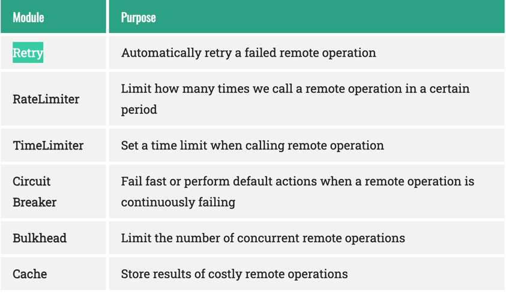

# Microservices-Design pattern
-----------------------
1. Service discovery using Spring Cloud Eureka Discovery Server and Eureca client.
2. Circuit breaker pattern using Spring Cloud and Resilience4j.
3. API gateway using Spring Cloud Gateway
4. Microservices logging tracing using Micrometer & zipkin
5. Spring cloud config server for dynamic configuration for microservices. Update configuration
   without CI CD
------------------------
## Service discovery using Eureka

To create Eureka discovery server, add the below dependency - 

    <dependency>
            <groupId>org.springframework.cloud</groupId>
            <artifactId>spring-cloud-starter-netflix-eureka-server</artifactId>
    </dependency>

In Main application, add this annotation and property
   
    @EnableEurekaServer

    server:port: 8761 -- default for Eureka server

To register clients, with Eureka server, add below dependency and property

    <dependency>
                <groupId>org.springframework.cloud</groupId>
                <artifactId>spring-cloud-starter-netflix-eureka-client</artifactId>
    </dependency>

    spring.application.name: user-details-microservice

On application start, microservice will register itself with Eureka server running on default port

In my setup, 

    user-microservice 
                        -> user-details-microservice 
                        -> user-career-microservice

Add @EnableDiscoveryClient in user-microservice main class

Since all microservices are registered with Eureka server, user-microservice can call other microservices by name
(registered with Eureka) instead of hardcoded ip. 

    private final String userDetailsMicroservice = "http://user-details-microservice/api/v1/users/";
    private final String userCareerMicroservice = "http://user-career-microservice/api/v1/users/";

## Circuit breaker using Spring cloud resilience4j

Add the below dependencies in user-microservices

    <dependency>
            <groupId>org.springframework.cloud</groupId>
            <artifactId>spring-cloud-starter-circuitbreaker-resilience4j</artifactId>
    </dependency>
    <dependency>
            <groupId>org.springframework.boot</groupId>
            <artifactId>spring-boot-starter-actuator</artifactId>
    </dependency>
    <dependency>
            <groupId>org.springframework.boot</groupId>
            <artifactId>spring-boot-starter-aop</artifactId>
     </dependency>

Add the configurations for circuit breaking -
 - https://github.com/s-maity/microservices-patterns-and-tech/blob/circuit-breaker/user-microservice-async/src/main/resources/application.yaml

Code for circuit breaker and fallback:
- https://github.com/s-maity/microservices-patterns-and-tech/blob/circuit-breaker/user-microservice-async/src/main/java/org/example/users/UserDetailsAggregateService.java

      @CircuitBreaker(name = "userDetailsServiceCircuitBreaker", fallbackMethod = "getDefaultUserDetails")
      public UserDetailsDto getUserDetailsUsingRestTemplate(int id) {
      ResponseEntity<UserDetailsDto> response
       = restTemplate.getForEntity(userDetailsMicroservice + id, UserDetailsDto.class);
   
           var userDetails = response.getBody();
           log.info("user={}", userDetails);
           return userDetails;
       }
   
       public UserDetailsDto getDefaultUserDetails(Exception e) {
           return UserDetailsDto.builder()
                   .id(0)
                   .name("Unknown")
                   .org("Unknown")
                   .build();
       }

We can check the status of the circuit in this end point -
   http://localhost:8073/actuator/health

We can also implement retry, ratelimiter etc. 

  source: https://reflectoring.io/retry-with-resilience4j/
